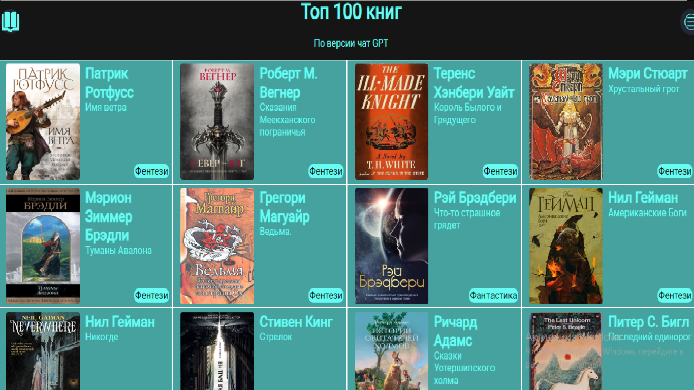

# Choose Book

Приложение для побора книг основанное на  гайде SFC signal. Также можно подобрать похожие книги c сервиса Fantlab и топ 100 книг bbc.

Этот проект собрал при помощи [Create React App](https://github.com/facebook/create-react-app).

## Использованны технологии

## Запуск

У вас должен быть установлен nodejs последней версии

В рабочей дирректории установите зависимости:

### `npm install`

Запуститте проект

### `npm start`

#### Ссылка на проект
https://incomparable-semolina-fe7ed1.netlify.app/
